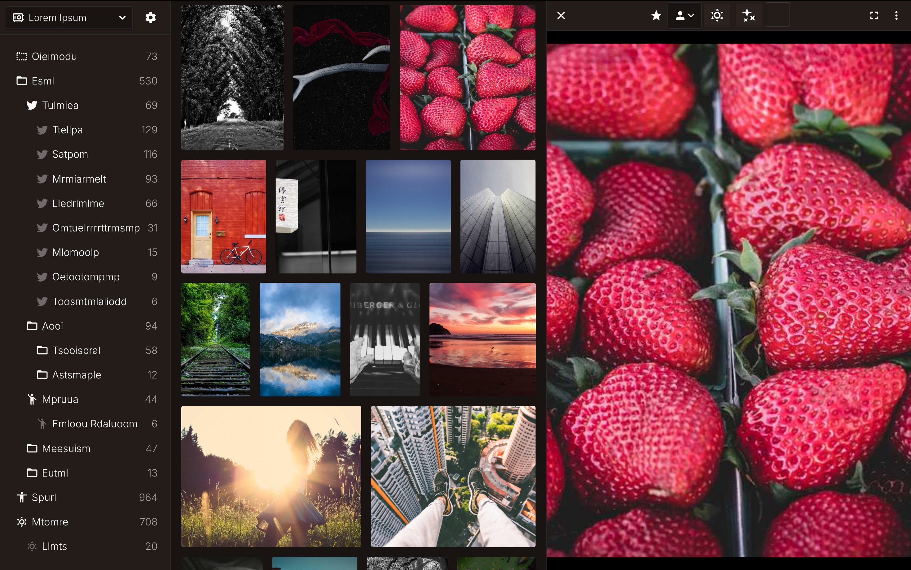

# Stash

Stash is a feature-rich, tag-based library web application designed to organize media into searchable collections.

<div align="center">
  
</div>

## Features

- **Media Support:** Supports images, videos, and markdown stories with a built-in reader.
- **Hierarchical Tags:** A linked and hierarchical tag system for precise media organization and search.
- **AI Tagging:** Automatically tags images using LLMs (via OpenRouter) based on user-defined tag descriptions.
- **Importing:** Supports direct browser uploads, local server directory imports, and integration with Transmission.

## Architecture & Tech Stack

- **Frontend (`_frontend`):** Built with **SvelteKit** and Vite.
- **Worker (`_worker`):** High-performance background jobs powered by **Bun** and TypeScript. Handles media thumbnail generation, AI tagging, and metadata extraction.
- **Gatekeeper (`_gatekeeper`):** High-performance media serving and proxying written in **Go**.
- **Desktop Client (`_desktop_client`):** Electron-based desktop client for localized usage.
- **Database:** **PostgreSQL** accessed via Prisma ORM.

## Getting Started

1. Clone the repository.
2. Review the provided `docker-compose.example.yml` and adjust the volume paths to match your system. Rename it to `docker-compose.yml`.
3. Copy `.env.example` to `.env` and configure the necessary environment variables (e.g., database connection string, OpenRouter keys, etc.).
4. Start the stack:

```bash
docker-compose up -d
```

## Testing

End-to-end tests use **Playwright** (Chromium) to navigate the app like a real user and
capture screenshots for visual regression comparison.

### Quick start

```bash
pnpm test:all          # full lifecycle: infra → seed → server → Playwright → cleanup
```

### Individual scripts

| Script                       | Description                                           |
| ---------------------------- | ----------------------------------------------------- |
| `pnpm test:all`              | Run the full test suite (recommended)                 |
| `pnpm test:infra:up`         | Start Postgres & Redis containers                     |
| `pnpm test:infra:down`       | Stop test containers                                  |
| `pnpm test:seed`             | Seed the test database (requires `TEST_DATABASE_URL`) |
| `pnpm test:run`              | Run Playwright tests (requires a running server)      |
| `pnpm test:update-snapshots` | Run tests and update baseline screenshots             |

### Visual regression

Screenshots are stored in `tests/snapshots/` (tracked via Git LFS). On the first run, use
`pnpm test:update-snapshots` to create baselines. Subsequent `pnpm test:run` calls compare
against these baselines with a 1% pixel diff tolerance.
